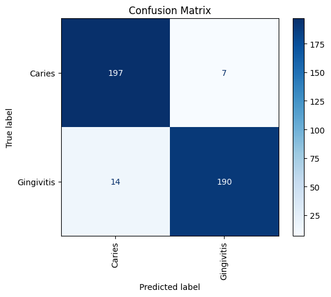

# Disease Classification Model

This repository contains a machine learning model for disease classification, implemented using PyTorch and deployed with Streamlit.

[Download the video](./readme_assets/video.mp4)


## Repository Structure

- `models/`: Contains the trained model files.
- `train.py`: Script to train the model.
- `preprocessing.py`: Script to preprocess the dataset and create dataloaders.
- `engine.py`: Contains the training and testing steps.
- `prediction.py`: Contains the prediction function.
- `deployment.py`: The Streamlit app script.

## Usage

### Cloning the Repository

Clone the repository to your local machine:

```bash
git clone https://github.com/end-9214/Disease_classification_model.git
cd Disease_classification_model
```
### Installing Dependencies

Install the required dependencies using `pip`:
```bash
pip install -r requirements.txt
```
### Training the Model

```bash
python train.py
```
This script will:

  * Load and preprocess the dataset using `preprocessing.py`.
  * Define and train the model using the functions in `engine.py`.
  * Save the trained model to the `models/` directory.

### Accessing the Streamlit App

The Streamlit app provides an interactive interface to use the disease classification model. To access the app:

Ensure you have Streamlit installed:
```bash
pip install streamlit
Run the Streamlit app:
```
```bash
streamlit run deployment.py
```
Open your web browser and navigate to the provided local URL to interact with the app.

### Prediction Function
The `prediction.py` script contains the function to make predictions using the trained model. It is used within the Streamlit app to display predictions and their probabilities



